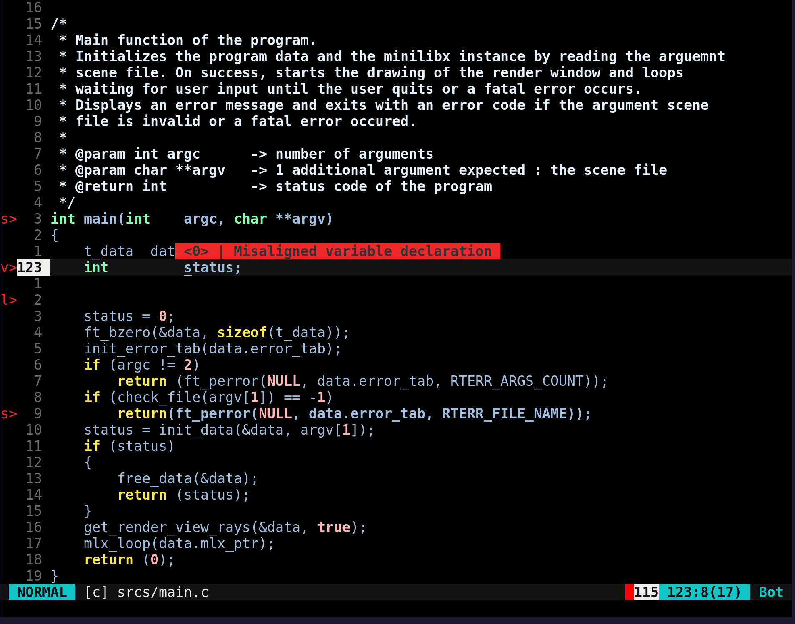
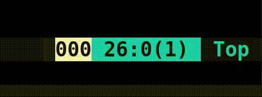

# Viminette - VIM builtin 42 norminette ✅❎
A vim plugin for builtin 42 norm error highlighting.<br>
No need to switch away from VIM to check your file norm anymore !



# Installation

### Norminette
The plugin runs the 42 norminette executable installed on your system.<br>
If you don't have it installed yet, get it at [42_official_norminette], else it just won't work.

### Plugins manager
You will also need a VIM plugin manager.<br>
Get yours at https://github.com/junegunn/vim-plug, and follow the instructions.

### Viminette plugin
Clone the viminette repository in your file system...
```
git clone git@github.com:Hnogared/viminette_VIM-42-norminette.git
```
...and plug it in your *.vimrc* file in your home repository (create it if needed)
```vim
[...]
call plug#begin()

Plug '<path_to_viminette_directory>'

call plug#end()
[...]
```

You are now good to go ! :+1:

# Usage

### Enabling norm highlighting
```
:Norminette
```
Turn on norm highlighting if the shell norminette command call was successfull.<br>
Once turned on, the highlighting refreshes after each file save (VIM's `BufWritePos` event) until turned off or an error occurs.

### Disabling norm highlighting
```
:NoNorminette
```
Turn off norm highlighting if it was initially turned on.

### Jumping between norm error lines
> [!NOTE]
> These commands only do something if norm error lines are currently displayed in the file.

```
:NextSign
```
Jump to the closest error line in the file after the cursor line. Jump to the first one if none is present after the cursor.

---
```
:PrevSign
```
Jump to the closest error line before the cursor line. Jump to the last one if none is present before the cursor.

---
```
:NextSignCycle
```
Cycle through the error lines from top to bottom. Jump back to the first one from the last one.

---
```
:PrevSignCycle
```
Cycle through the error lines from bottom to top. Jump back to the last one from the first one.

# Status line
The plugin's status can be displayed on the status bar.<br>
The `viminette#getNormStatus()` function call returns the status of the norm highlighting.<br>

- 0 = norm highlighting is turned OFF
- 1 = norm highlighting is turned ON and there are no norm errors in the file
- 2 = norm highlighting is turned ON and there are norm errors in the file

This status can be used to update VIM's status line depending on the norm status on your *.vimrc* file :
```vim
" Example on how to implement different colored indicators in the status line depending on the norm status
[...]
hi NormOff ctermbg=234 guibg=#616161
hi NormOn ctermbg=40 guibg=#00FF00
hi NormError ctermbg=196 guibg=#FF0000

set statusline = ...
set statusline += %{%viminette#getNormStatus()==0?'%#NormOff# ':''%}
set statusline += %{%viminette#getNormStatus()==1?'%#NormOn# ':''%}
set statusline += %{%viminette#getNormStatus()==2?'%#NormError# ':''%}
set statusline += ...
[...]
```

```vim
" Example on how to implement different colored indicators in the status line depending on the norm status
" with a function
" This won't work on older versions
[...]
hi NormOff ctermbg=234 guibg=#616161
hi NormOn ctermbg=40 guibg=#00FF00
hi NormError ctermbg=196 guibg=#FF0000

function! MyStatusLine() abort
  let res = ...
  let res .= '%{%viminette#getNormStatus()==0?"%#NormOff# ":""%}'
  let res .= '%{%viminette#getNormStatus()==1?"%#NormOn# ":""%}'
  let res .= '%{%viminette#getNormStatus()==2?"%#NormError# ":""%}'
  let res .= ...
  return res
endfunction

set statusline=%!MyStatusLine()
[...]
```
 

<sup>What an implementation from above could look like on a VIM status line (the colored rectangle shows the norm status)</sup>

# Special thanks

Thank you [Leizar06001](https://github.com/Leizar06001) for the name idea. Go check out their cool projects !

[42_official_norminette]:https://github.com/42School/norminette
